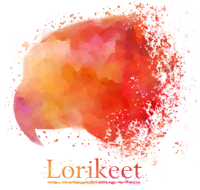

[](https://travis-ci.com/rhysnewell/Lorikeet)
[](https://codecov.io/gh/rhysnewell/Lorikeet)
[](https://www.gnu.org/licenses/gpl-3.0)




A strain resolver for metagenomics.

## Installation

#### option 1: Cargo
```
cargo install Lorikeet
```

#### option 2: Conda
*Not implemented yet*

#### option 3: Build manually
```
git clone https://github.com/rhysnewell/Lorikeet/git && cd Lorikeet && cargo build --release
```


## Usage

Input can either be reads and reference genome, or MAG. Or a BAM file and associated genome.

```
Strain genotyping analysis for metagenomics

Usage: lorikeet <subcommand> ...

Main subcommands:
    genotype    *Experimental* Resolve strain-level genotypes of MAGs from microbial communities
    polymorph   Calculate variants along contig positions
    summarize   Summarizes contig stats from multiple samples
    evolve  Calculate dN/dS values for genes from read mappings

Less used utility subcommands:
    kmer    Calculate kmer frequencies within contigs
    filter    Remove (or only keep) alignments with insufficient identity

Other options:
    -V, --version   Print version information

Rhys J. P. Newell <r.newell near uq.edu.au>
```

Genotype from bam:

`lorikeet genotype -b input.bam -r input_genome.fna --e-min 0.1 --e-max 0.5 --pts-min 0.1 --pts-max 0.5`

Genotype from reads:

`lorikeet genotype -r input_genome.fna -1 forward_reads.fastq -2 reverse_reads.fastq`

## Output

#### Genotype 
Genotype will produce multiple .fna files representative of the expected strain level genotypes

#### Polymorph
Polymorph produces a tab delimited file containing possible variants and their positions within the reference

#### Evolve
Evolve will produce dN/dS values within coding regions based on the possible variants found along the reference.
These dN/dS values only take single nucleotide polymorphisms into account but INDELs can still be reported.