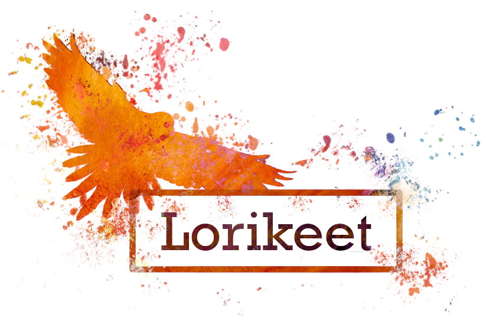

## Introduction

Lorikeet is a within-species variant analysis pipeline for metagenomic communities that utilizes both long and short read datasets.
Lorikeet combines short read variant calling with Freebayes and long read structural variant calling with SVIM to generate a 
complete variant landscape present across samples within a microbial community. SNV are also linked together using read 
information to help provide likely genotypes based on observed physical linkages.

## Installation

#### Option 1: Conda

*NOTE:* The conda version is often a few commits and/or versions behind the development version. If you want the most
up to date version, follow the instruction in option 2. 

Install into current conda environment:
```
conda install lorikeet-genome
```

Create fresh conda environment and install lorikeet there:
```
conda create -n lorikeet -c bioconda lorikeet-genome && \
conda activate lorikeet
```

#### Option 2: Install manually
You may need to manually set the paths for `C_INCLUDE_PATH`, `LIBRARY_PATH`, `LIBCLANG_PATH`, and `OPENSSL_DIR` to their corresponding
paths in the your conda environment if they can't properly be found on your system.
```
git clone --recursivehttps://github.com/rhysnewell/Lorikeet.git \ 
cd Lorikeet \
conda env create -n lorikeet -f lorikeet.yml \ 
conda activate lorikeet \ 
bash install.sh # or e.g. `cargo run -- genotype`
```

Depending on your local network configuration, you may have problems obtaining Lorikeet via git.
If you see something like this you may be behind a proxy that blocks access to standard git:// port (9418).

```
$ git clone --recursive git://github.com/rhysnewell/Lorikeet.git
Cloning into 'Lorikeet'...
fatal: Unable to look up github.com (port 9418) (Name or service not known)
```

Luckily, thanks to this handy tip from the developer of [Freebayes](https://github.com/ekg/freebayes) we can work around it.
If you have access to https:// on port 443, then you can use this 'magic' command as a workaround to enable download of the submodules:

```
git config --global url.https://github.com/.insteadOf git://github.com/
```

## Usage

Input can either be reads and reference genome, or MAG. Or a BAM file and associated genome.

```
Strain genotyping analysis for metagenomics

Usage: lorikeet <subcommand> ...

Main subcommands:
    genotype    *Experimental* Resolve strain-level genotypes of MAGs from microbial communities
    polish      Creates consensus genomes for each input reference and for each sample
    summarize   Summarizes contig stats from multiple samples
    evolve      Calculate dN/dS values for genes from read mappings

Less used utility subcommands:
    kmer      Calculate kmer frequencies within contigs
    filter    Remove (or only keep) alignments with insufficient identity

Other options:
    -V, --version   Print version information

Rhys J. P. Newell <r.newell near uq.edu.au>
```

Genotype from bam:

`lorikeet genotype --bam-files my.bam --longread-bam-files my-longread.bam --genome-fasta-directory genomes/ -x fna
     --bam-file-cache-directory saved_bam_files --output-directory lorikeet_out/ --threads 10 --plot`

Genotype from short reads and longread bam:

`lorikeet genotype -r input_genome.fna -1 forward_reads.fastq -2 reverse_reads.fastq -l longread.bam`

## Workflow


## Output

#### Genotype 
Genotype will produce:
- Variants that clustered into representations of the expected strain level genotypes
- Sample adjacency matrix displaying the number of shared variants seen between samples.
- VCF file detailing all observed variants
- Expected coverage values for each of the produced genotypes in each sample
- Per reference and per sample summary statistics displaying the mean SNPs and structural
  variations per provided base pair window
*optional*
- SNP density plot. Can take a long time to generate
#### Polish
Polish produces:
- Consensus genomes for each input reference across each sample.
- Sample adjacency matrix displaying the number of shared variants seen between samples.
- VCF file detailing all observed variants
- Per reference and per sample summary statistics displaying the mean SNPs and structural
  variations per provided base pair window
*optional*
- SNP density plot. Can take a long time to generate

#### Evolve
Evolve will produce:
- GFF file for each input reference with dN/dS values within coding regions based on the possible variants 
  found along the reference
    - These dN/dS values only take single nucleotide polymorphisms into account but INDELs can still be reported.
- VCF file detailing all observed variants
- Per reference and per sample summary statistics displaying the mean SNPs and structural
  variations per provided base pair window
*optional*
- SNP density plot. Can take a long time to generate

#### Summarize
- Per reference and per sample summary statistics displaying the mean SNPs and structural
  variations per provided base pair window
*optional*
- SNP density plot. Can take a long time to generate